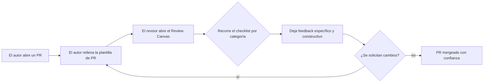

  
  <strong> | </strong>
  

# PR Review Canvas

**Un kit de supervivencia para revisiones de código gratuito y de código abierto — checklists, plantillas, guías y un panel interactivo en tiempo real para cualquiera que revise pull requests.**

[**🟢 Abrir el checklist interactivo →**](https://projekta2.github.io/pr-review-canvas/es/)

---

## Qué es esto

La mayoría de los «checklists de revisión de código» que circulan por internet son un simple Gist con doce puntos. Esto es lo contrario: un kit completo y con criterio propio que cubre todo el ciclo de vida de una revisión — desde redactar la descripción del PR, hasta revisarlo línea por línea, hasta dar feedback que no acabe en una pelea en los comentarios.

Está pensado para tres tipos de personas:

- **Desarrolladores que revisan sus primeros PRs**, que necesitan una estructura para no limitarse a asentir con la cabeza.
- **Ingenieros senior y tech leads**, que quieren un estándar compartido al que todo el equipo pueda referirse en lugar de explicar el mismo comentario por centésima vez.
- **Equipos que están montando un proceso de revisión desde cero**, que quieren plantillas que puedan bifurcar y adaptar en lugar de escribir desde una página en blanco.

Todo el contenido es agnóstico al framework, agnóstico al lenguaje y atemporal — no hay nada en este repositorio que quede obsoleto cuando un framework de JavaScript cambia su API.

## Pruébalo en vivo

El checklist no es sólo un archivo markdown que tienes que imaginar marcando. Es una herramienta interactiva real con una puntuación de «Preparación de la Revisión», categorías desplegables y progreso guardado en tu navegador:

**👉 [projekta2.github.io/pr-review-canvas/es/](https://projekta2.github.io/pr-review-canvas/es/)**

Sin instalación, sin cuenta, sin rastreo. Ábrelo, marca lo que corresponda y exporta tus notas cuando hayas terminado.

## Qué contiene

| Ruta | Qué es |
|---|---|
| [`checklists/es/pr-review-checklist.md`](checklists/es/pr-review-checklist.md) | El checklist completo de 51 ítems, organizado en 8 categorías, con un «por qué» para cada ítem |
| [`docs/es/index.html`](docs/es/index.html) | El mismo checklist como herramienta interactiva autocontenida, válida sin conexión |
| [`checklists/pr-review-checklist-template.md`](checklists/pr-review-checklist-template.md) | Una versión en blanco y editable para equipos que quieran adaptarla a sus propios estándares |
| [`templates/es/pr-template.md`](templates/es/pr-template.md) | Una plantilla ligera de descripción de PR para cambios cotidianos |
| [`templates/es/pr-template-advanced.md`](templates/es/pr-template-advanced.md) | Una plantilla más completa para cambios complejos, de alto riesgo o entre equipos |
| [`guides/es/for-beginners.md`](guides/es/for-beginners.md) | Una guía paso a paso para revisar tus primeros PRs sin perderte |
| [`guides/es/for-experts.md`](guides/es/for-experts.md) | Técnicas para revisar rápido a escala, y cuándo delegar o automatizar |
| [`guides/es/how-to-give-feedback.md`](guides/es/how-to-give-feedback.md) | Patrones de feedback constructivo, frases que funcionan y frases que hay que jubilar |
| [`guides/es/how-to-receive-feedback.md`](guides/es/how-to-receive-feedback.md) | El lado del autor: cómo recibir el feedback de una revisión sin tomártelo como algo personal |
| [`examples/es/good-pr-example.md`](examples/es/good-pr-example.md) | Un ejemplo anotado de un PR bien escrito, y por qué funciona |
| [`examples/es/bad-pr-example.md`](examples/es/bad-pr-example.md) | Un ejemplo anotado de un PR mal escrito, y cómo corregir cada problema |
| [`examples/es/annotated-review-example.md`](examples/es/annotated-review-example.md) | Una transcripción completa de una revisión, comentario a comentario, con el razonamiento detrás |
| [`resources/es/code-review-antipatterns.md`](resources/es/code-review-antipatterns.md) | Los patrones recurrentes con los que las revisiones de código salen mal, en ambos lados del diff |
| [`resources/es/notion-template.md`](resources/es/notion-template.md) | Una versión lista para pegar del checklist en Notion |
| [`resources/es/obsidian-template.md`](resources/es/obsidian-template.md) | Una versión lista para pegar del checklist en Obsidian |
| [`resources/es/linear-template.md`](resources/es/linear-template.md) | Una versión lista para pegar del checklist en Linear |
| [`resources/es/jira-template.md`](resources/es/jira-template.md) | Una versión lista para pegar del checklist en Jira |
| [`resources/es/github-projects-template.md`](resources/es/github-projects-template.md) | Una guía para configurar un tablero de GitHub Projects para hacer seguimiento de las revisiones con la metodología Canvas |

## Cómo usarlo

**Como revisor individual:** guarda en favoritos el [checklist en vivo](https://projekta2.github.io/pr-review-canvas/es/) y úsalo en tu próximo PR. Tarda unos cinco minutos y detectará cosas que una lectura rápida pasa por alto.

**Como equipo:** bifurca este repositorio, abre [`checklists/pr-review-checklist-template.md`](checklists/pr-review-checklist-template.md) y recórtalo o amplíalo hasta que se ajuste a cómo trabaja realmente tu equipo. Copia [`templates/es/pr-template.md`](templates/es/pr-template.md) en tu `.github/PULL_REQUEST_TEMPLATE.md` para que todos los PRs partan desde la misma base.

**Como recién llegado:** lee primero [`guides/es/for-beginners.md`](guides/es/for-beginners.md). Está escrito para el momento justo después de que te asignen tu primera revisión y no sepas por dónde empezar.

## Por qué importa esto

Un checklist de revisión de código no es burocracia — es el sustituto del ingeniero senior que te ayuda desde detrás y que no siempre está disponible. Las categorías de este kit (contexto, arquitectura, calidad del código, pruebas, rendimiento y seguridad, documentación, estándares, lectura final) mapean la secuencia real que sigue el cerebro de un revisor experimentado, simplemente hecha explícita para que sea enseñable.

## Del mismo taller

Este kit surgió del mismo agotamiento ante las revisiones que llevó a construir **[PR Focus AI Pro](https://chromewebstore.google.com/detail/pr-focus-ai-pro/ememaiabefeojkccjclglcmbjmdpnaoe)** — una extensión de navegador que clasifica y resume los pull requests de GitHub para el revisor *humano*, en lugar de intentar reemplazarlo con un bot que deja comentarios automáticos. Si te ves usando este checklist en PRs todos los días, ese es el hueco que cubre. ([Página en Gumroad](https://projekta2.gumroad.com/l/PRFocusAIPro) · licencia de pago único.)

Las decisiones técnicas detrás de estas herramientas — incluyendo el razonamiento real, los bugs y las concesiones, no sólo los momentos estelares — están documentadas en **[Build Logs](https://github.com/projekta2/build-logs)**, un diario de ingeniería que registra cómo se construyen las herramientas de Projekta2.

## Contribuir

Este kit mejora con más opiniones de revisores. Nuevos ítems en el checklist, frases de feedback más precisas, versiones traducidas, o una plantilla para un flujo de trabajo que esto no cubra todavía — todo es bienvenido. Consulta [`CONTRIBUTING.md`](CONTRIBUTING.md).

## Licencia

[MIT](LICENSE) — úsalo, bifúrcalo, adáptalo para tu equipo, sin necesidad de atribución (aunque siempre se agradece una estrella).

---

Si esto le ha ahorrado a tu equipo una vuelta de ida y vuelta en un PR, considera darle una estrella al repositorio — ayuda a que otros desarrolladores lo encuentren.

