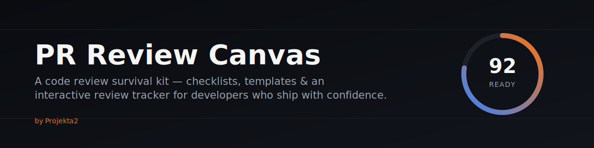
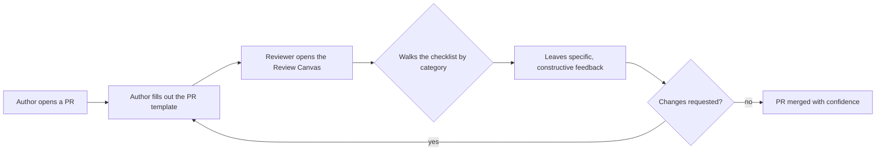

# PR Review Canvas

**A free, open code review survival kit — checklists, templates, guides, and a live interactive tracker for anyone who reviews pull requests.**

[**🟢 Open the interactive checklist →**](https://projekta2.github.io/pr-review-canvas/)

---

## What this is

Most "code review checklists" online are a single Gist with twelve bullet points. This is the opposite: a complete, opinionated kit covering the entire review lifecycle — from writing the PR description, to reviewing it line by line, to giving feedback that doesn't start a fight in the comments thread.

It's built for three kinds of people:

- **Developers reviewing their first PRs**, who want a structure so they're not just nodding along.
- **Senior engineers and tech leads**, who want a shared standard the whole team can point to instead of re-explaining the same comment for the hundredth time.
- **Teams setting up a review process from scratch**, who want templates they can fork and adapt instead of writing one from a blank page.

Everything here is framework-agnostic, language-agnostic, and evergreen — there's nothing in this repo that goes stale when a JavaScript framework changes its API.

## Try it live

The checklist isn't just a markdown file you have to imagine ticking off. It's a real interactive tool with a "Review Readiness" score, collapsible categories, and progress that's saved in your browser:

**👉 [projekta2.github.io/pr-review-canvas](https://projekta2.github.io/pr-review-canvas/)**

No install, no account, no tracking. Open it, check things off, export your notes when you're done.

## What's inside

| Path | What it is |
|---|---|
| [`checklists/pr-review-checklist.md`](checklists/pr-review-checklist.md) | The full 51-item checklist, organized into 8 categories, with a "why" for every item |
| [`checklists/interactive-checklist.html`](checklists/interactive-checklist.html) | The same checklist as a self-contained, offline-capable interactive tool |
| [`checklists/pr-review-checklist-template.md`](checklists/pr-review-checklist-template.md) | A blank, editable version for teams who want to adapt it to their own standards |
| [`templates/pr-template.md`](templates/pr-template.md) | A lightweight PR description template for everyday changes |
| [`templates/pr-template-advanced.md`](templates/pr-template-advanced.md) | A fuller template for complex, high-risk, or cross-team changes |
| [`guides/for-beginners.md`](guides/for-beginners.md) | A step-by-step guide to reviewing your first PRs without feeling lost |
| [`guides/for-experts.md`](guides/for-experts.md) | Techniques for reviewing fast at scale, and when to delegate or automate |
| [`guides/how-to-give-feedback.md`](guides/how-to-give-feedback.md) | Constructive feedback patterns, phrases to use, and phrases to retire |
| [`guides/how-to-receive-feedback.md`](guides/how-to-receive-feedback.md) | The author's side: how to take review feedback without taking it personally |
| [`examples/good-pr-example.md`](examples/good-pr-example.md) | An annotated example of a well-written PR, and why it works |
| [`examples/bad-pr-example.md`](examples/bad-pr-example.md) | An annotated example of a poorly-written PR, and how to fix each issue |
| [`examples/annotated-review-example.md`](examples/annotated-review-example.md) | A full review transcript, comment by comment, with reasoning |
| [`resources/code-review-antipatterns.md`](resources/code-review-antipatterns.md) | The recurring ways code review goes wrong, on both sides of the diff |
| [`resources/notion-template.md`](resources/notion-template.md) | A ready-to-paste version of the checklist for Notion |
| [`resources/obsidian-template.md`](resources/obsidian-template.md) | A ready-to-paste version of the checklist for Obsidian |

## How to use it

**As an individual reviewer:** bookmark the [live checklist](https://projekta2.github.io/pr-review-canvas/) and run through it on your next PR. It takes about five minutes and it will catch things a quick skim won't.

**As a team:** fork this repo, open [`checklists/pr-review-checklist-template.md`](checklists/pr-review-checklist-template.md), and trim or extend it until it matches how your team actually works. Drop [`templates/pr-template.md`](templates/pr-template.md) into your `.github/PULL_REQUEST_TEMPLATE.md` so every PR starts from the same baseline.

**As a newcomer:** read [`guides/for-beginners.md`](guides/for-beginners.md) first. It's written for the moment right after you've been assigned your first review and have no idea where to start.

## Why this matters

A code review checklist isn't bureaucracy — it's a substitute for the senior engineer standing over your shoulder who isn't always available. The categories in this kit (context, architecture, code quality, testing, performance & security, documentation, standards, final read) map to the actual sequence an experienced reviewer's brain runs through, just made explicit so it's teachable.

## From the same shop

This kit grew out of the same review fatigue that led to building **[PR Focus AI Pro](https://chromewebstore.google.com/detail/pr-focus-ai-pro/ememaiabefeojkccjclglcmbjmdpnaoe)** — a browser-side extension that triages and summarizes GitHub pull requests for the *human* reviewer, instead of trying to replace them with a bot that leaves automated comments. If you find yourself running this checklist on PRs every day, that's the gap it fills. ([Gumroad page](https://projekta2.gumroad.com/l/PRFocusAIPro) · one-time license.)

The technical decisions behind these tools — including the actual reasoning, bugs, and trade-offs, not just the highlight reel — are written up in **[Build Logs](https://github.com/projekta2/build-logs)**, an engineering journal documenting how Projekta2's tools get built.

## Contributing

This kit gets better with more reviewers' opinions in it. New checklist items, sharper feedback phrasing, translated versions, or a template for a workflow this doesn't cover yet — all welcome. See [`CONTRIBUTING.md`](CONTRIBUTING.md).

## License

[MIT](LICENSE) — use it, fork it, adapt it for your team, no attribution required (though a star is always appreciated).

---

If this saved your team a round-trip on a PR, consider starring the repo — it helps other developers find it.

